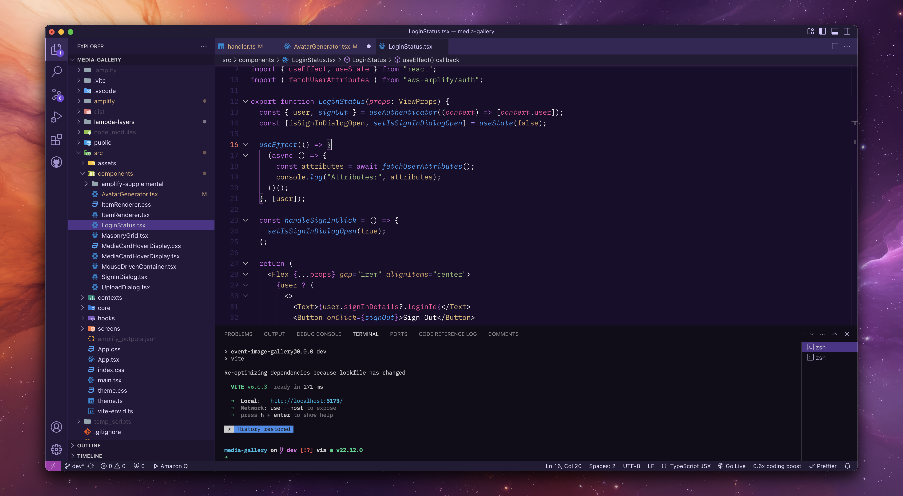

# Nova Theme

A dark theme for VS Code inspired by the [Amazon Nova](https://aws.amazon.com/ai/generative-ai/nova/) generative AI foundation models.

*Pictured above using the [IBM Plex Mono font](https://fonts.google.com/specimen/IBM+Plex+Mono?query=ibm+plex).*

This theme looks great with the desktop wallpaper below, generated with Amazon Nova Canvas.

